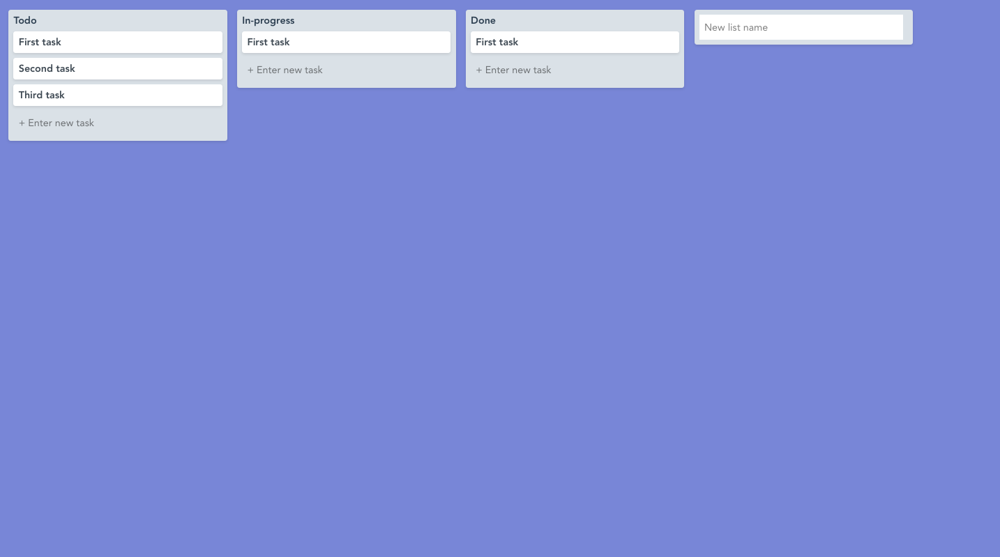

# Trello app using Vue/Vuex and PouchDB/CouchDB

## About the project

This is a Trello clone application to create lists and tasks with drag and drop functionality. Key features of the application are:

- Create board lists
- Create tasks for each list
- Update tasks
- Move tasks to other lists or within the existing list
- Create new list
- Move lists



## App components

### Building the board

The board contains a set of columns or lists and each list has a collection of tasks that can be moved across the board to different lists or within a list. Tailwind is used for maintaining the styling of the app.

### Store

The Vuex store is setup to manage the state of the board with its list and tasks. For this app a plugin is added to the store so we can listen for mutations being made to our Vuex store, and store them in the local browser storage, ensuring the board information is not lost on browser refresh.

The store has functions to `getTasks` at app initiation and updates the state of the board data through `mutation` functions like `CREATE_TASK`, `UPDATE_TASK`, `MOVE_COLUMN`. Each mutation is called in the relevant components to the update the board data store.

### Drag and drop Tasks and Lists

The [HTML drag and drop API](https://developer.mozilla.org/en-US/docs/Web/API/HTML_Drag_and_Drop_API) is used to move the tasks and the list columns in the app. To move the tasks `draggable` attribute is used on the task `div` wrapper which allows for it to be moved along with its content. `@dragstart` is used to listen to the event change on the DOM element and task and the list column index is passed to capture the change. The `setData` method on the `dataTransfer` interface is used to save the task and list index. This is similar to `localStorage` in that it can only store properties that can be `stringified`. The `@drop` event is used to capture the new list index where the task is dropped using the `getData` method.

### Extracting components

After adding the key functionalities of the application, some code refactor was done to remove duplication of data and functions used.

- Initially all the board lists and tasks were written as one component. Later, the board lists and tasks were separated into their own components. This improved readability of the code ensuring not any one component is too long.
- Components sharing duplicate data and methods like `moveTask` or `moveColumn` were separated into a `mixin`. Mixin is a Vue feature to distribute reusable functions across the application.
- Another place of code redundancy was the drag and drop API code which is used for both the `BoardColumn` and `Task` components. Two separate reusable components were created for `AddDrag` and `AddDrop` functions. These were used whenever there was a need to drag and drop an element.

### Setting up PouchDB and CouchDB

The app was initially setup using LocalStorage option to store the data. Then later it was updated to setup PouchDB to allow for offline data storage. The data structure in the Vuex store had to be updated to align with PouchDB. The data structure was initially with lists and tasked nested as JSON. To align with PouchDB best practices the data structure was normalized to save the lists and tasks separately in the Vue store with listId add to each task for reference. The app components were updated to agree with the new state structure.
CouchDB was then set up as a remote server to sync with the data in PouchDB. The local and remote sync can be tested by opening two browsers and seeing the changes made in one browser in the other.

## Built with

- VueJS
- Vuex for state management
- PouchDB and CouchDB
- [HTML drag and drop API](https://developer.mozilla.org/en-US/docs/Web/API/HTML_Drag_and_Drop_API)
- Tailwind for styling

## Install dependencies

```bash
npm install
```

## Running the app

After running the command, you can open http://localhost:8080 to view the app in the browser.

```bash
yarn run serve
```

The app is built using [VueMastery](https://www.vuemastery.com/) tutorials.
